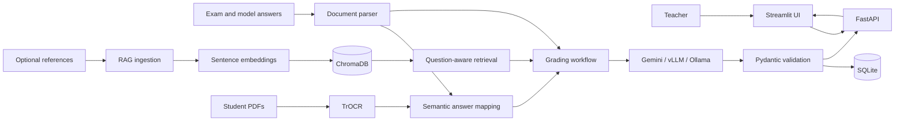

# AI-Assisted Answer Sheet Grading System

An academic grading workflow that combines handwritten-text recognition, semantic answer mapping, retrieval-augmented generation (RAG), and structured LLM evaluation.

The application provides a FastAPI backend and a Streamlit interface for uploading an exam with model answers, optionally indexing supporting references, and grading batches of student answer-sheet PDFs.

## Key features

- Extracts handwritten text from PDF answer sheets with TrOCR.
- Maps OCR text chunks to exam questions using SentenceTransformers and cosine similarity.
- Parses exam questions, model answers, and marks from text or PDF files.
- Indexes optional rubrics and reference documents in persistent ChromaDB storage.
- Retrieves question-aware context to support grading without replacing the official model answer.
- Produces Pydantic-validated marks and feedback through Gemini, vLLM, or Ollama.
- Retries transient LLM failures and optionally falls back from Gemini to vLLM.
- Uses bounded concurrency for OCR and LLM grading workloads.
- Persists students, mapped answers, marks, and feedback in SQLite.
- Rate-limits expensive ingestion and grading endpoints.
- Presents results and totals in a teacher-facing Streamlit UI.

## Architecture



Semantic mapping and RAG serve different purposes. Semantic mapping assigns OCR text to the most likely exam question. RAG retrieves supporting rubric or reference material for the grading prompt. The model answer remains the primary grading source.

## Project structure

```text
.
├── backend/
│   ├── app/
│   │   ├── api/          # Health, RAG, and grading routes
│   │   ├── core/         # Configuration and rate limiting
│   │   ├── database/     # SQLite persistence
│   │   ├── llm/          # Providers, prompts, tools, retry, and fallback
│   │   ├── rag/          # Chunking, vector storage, and retrieval
│   │   ├── schemas/      # Structured grading models
│   │   └── services/     # OCR, parsing, mapping, and grading workflow
│   ├── .env.example
│   ├── Dockerfile
│   └── requirements.txt
├── frontend/
│   ├── app.py            # Streamlit teacher interface
│   └── Dockerfile
├── tests/                # Unit and integration tests
├── data/exam_files/      # Sample exam/model-answer input
├── docker-compose.yml
└── proj.ipynb            # Original notebook prototype
```

## Prerequisites

- Python 3.12
- Poppler, used to convert PDF pages to images
- A Gemini API key when `LLM_PROVIDER=gemini`
- Sufficient memory to load the OCR and embedding models
- A suitable GPU and model storage for practical vLLM deployment

Install Poppler on Ubuntu or Debian:

```bash
sudo apt-get update
sudo apt-get install poppler-utils
```

If Poppler is installed somewhere that is not on `PATH`, set `POPPLER_PATH` in `backend/.env`.

## Local setup

Run all commands from the repository root:

```bash
python3 -m venv .venv
source .venv/bin/activate
python -m pip install --upgrade pip
python -m pip install -r backend/requirements.txt
cp backend/.env.example backend/.env
```

Open `backend/.env` and provide the credentials and provider settings you intend to use:

```dotenv
LLM_PROVIDER=gemini
GEMINI_API_KEY=your_api_key
GEMINI_MODEL=gemini-3.6-flash
```

`backend/.env` is ignored by Git. Do not place real credentials in source code, tests, documentation, or Docker configuration.

### Start the backend

```bash
.venv/bin/uvicorn backend.app.main:app --reload
```

The API is available at <http://127.0.0.1:8000>. Verify it with:

```bash
curl http://127.0.0.1:8000/api/health
```

### Start the frontend

In a second terminal:

```bash
BACKEND_URL=http://127.0.0.1:8000 \
  .venv/bin/streamlit run frontend/app.py
```

Open <http://127.0.0.1:8501> in a browser.

## Teacher workflow

1. Upload an exam/model-answer file in `.txt` or `.pdf` format.
2. Optionally upload rubric or reference files and select **Ingest References**.
3. Upload one or more student answer-sheet PDFs.
4. Select **Start Grading**.
5. Review marks, totals, feedback, and any OCR text that could not be mapped confidently.

Reference ingestion returns a `reference_set_id`. The Streamlit session automatically includes that identifier in later grading requests.

## Exam file format

Text exams use `Q<number>` and `A<number>` pairs. Marks may be written in the question or at the end of its model answer.

```text
Q1: What is retrieval-augmented generation? (5)
A1: Retrieval-augmented generation retrieves relevant context before an LLM produces its answer.

Q2: State one benefit of semantic search.
A2: It can match text by meaning rather than exact keywords. (3)
```

See [`data/exam_files/qna.txt`](data/exam_files/qna.txt) for a complete sample.

## API

Interactive OpenAPI documentation is available at <http://127.0.0.1:8000/docs> while the backend is running.

| Method | Endpoint | Purpose |
| --- | --- | --- |
| `GET` | `/api/health` | Check backend availability |
| `POST` | `/api/rag/ingest` | Parse and index an exam plus optional reference files |
| `POST` | `/api/grading/evaluate` | Grade one or more student PDFs |

### Ingest references

```bash
curl -X POST http://127.0.0.1:8000/api/rag/ingest \
  -F "exam_file=@data/exam_files/qna.txt" \
  -F "reference_files=@path/to/rubric.pdf"
```

### Grade answer sheets

```bash
curl -X POST http://127.0.0.1:8000/api/grading/evaluate \
  -F "exam_file=@data/exam_files/qna.txt" \
  -F "student_files=@path/to/student-01.pdf" \
  -F "student_files=@path/to/student-02.pdf" \
  -F "reference_set_id=REFERENCE_SET_ID"
```

Omit `reference_set_id` when grading without previously ingested RAG context.

## Configuration

All backend settings are defined in [`backend/.env.example`](backend/.env.example).

| Variable | Default | Description |
| --- | --- | --- |
| `LLM_PROVIDER` | `gemini` | Grading provider: `gemini`, `vllm`, or `ollama` |
| `GEMINI_API_KEY` | empty | Gemini credential; required for the Gemini provider |
| `GEMINI_MODEL` | `gemini-3.6-flash` | Gemini model identifier |
| `ENABLE_VLLM_FALLBACK` | `true` | Fall back to vLLM after retryable Gemini failures |
| `VLLM_BASE_URL` | `http://localhost:8001/v1` | OpenAI-compatible vLLM endpoint |
| `OLLAMA_MODEL` | `mistral` | Model used by the Ollama provider |
| `TROCR_MODEL` | `microsoft/trocr-base-handwritten` | Handwriting-recognition model |
| `EMBEDDING_MODEL` | `all-MiniLM-L6-v2` | Semantic embedding model |
| `SIMILARITY_THRESHOLD` | `0.6` | Minimum score for mapping an OCR chunk to a question |
| `OCR_CONCURRENCY` | `1` | Maximum concurrent OCR/mapping jobs |
| `LLM_CONCURRENCY` | `3` | Maximum concurrent grading calls |
| `RAG_TOP_K` | `4` | Maximum retrieved chunks per query |
| `RATE_LIMIT_REQUESTS` | `10` | Requests allowed per endpoint window and client |
| `RATE_LIMIT_WINDOW_SECONDS` | `60` | Rate-limit window length |

## Docker Compose

Compose starts the backend, frontend, and vLLM services. Provide Compose variables through the shell or an ignored `.env` file at the repository root:

```bash
export GEMINI_API_KEY=your_api_key
docker compose up --build
```

| Service | Address |
| --- | --- |
| Backend API | <http://127.0.0.1:8000> |
| Streamlit UI | <http://127.0.0.1:8501> |
| vLLM API | <http://127.0.0.1:8001> |

The vLLM container downloads and serves `TinyLlama/TinyLlama-1.1B-Chat-v1.0` by default and may require substantial startup time, storage, and GPU resources. Compose does not read `backend/.env`; that file is used by direct backend runs.

## Tests

```bash
.venv/bin/python -m compileall -q backend frontend tests
.venv/bin/python -m pytest -q
```

The suite covers document parsing, structured responses, Gemini tool calls, RAG ingestion and retrieval, reliability behavior, rate limiting, bounded asynchronous grading, and the vLLM integration.

## Reliability and safety

- LLM calls use bounded exponential-backoff retries.
- Retryable Gemini failures can fall back to vLLM.
- Invalid uploads return `400`; rate-limit violations return `429`; dependency failures return `503` where applicable.
- Pydantic validation clamps awarded marks to the valid range.
- Uploaded files are processed in temporary directories.
- Expensive operations use explicit concurrency limits.
- Runtime databases, ChromaDB data, model caches, uploaded PDFs, and environment files are excluded from version control.

## Limitations

- OCR accuracy depends on scan quality and handwriting clarity.
- TrOCR, SentenceTransformer, and local LLM weights must be downloaded before their first use.
- vLLM generally requires an appropriate Linux/GPU environment for practical inference.
- The built-in rate limiter stores state in one process; a multi-instance deployment needs shared rate-limit storage.
- SQLite and local ChromaDB storage suit this academic implementation but require additional planning for distributed deployment.
- AI-generated marks and feedback should be reviewed by a qualified teacher before being treated as final.
