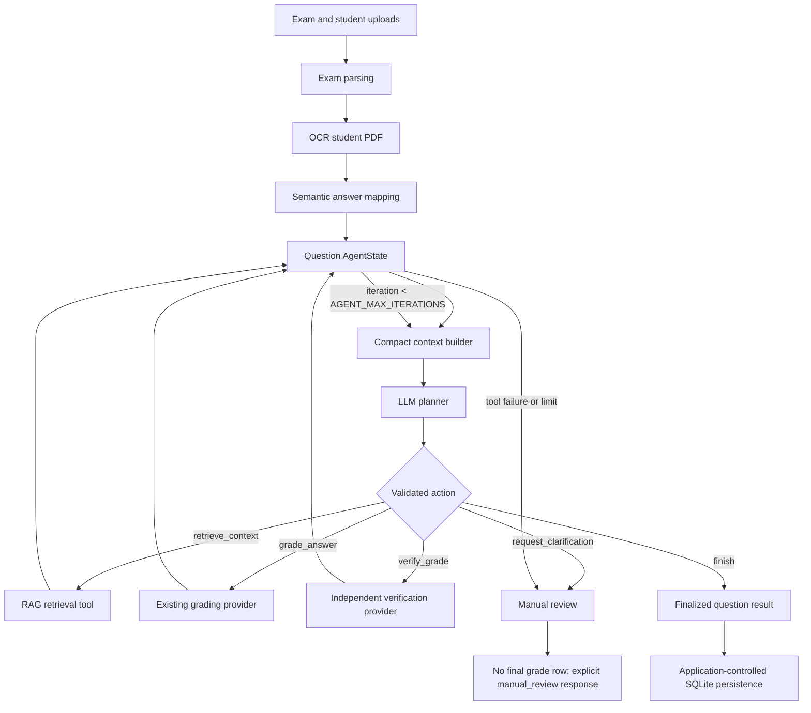

# Week 16 Architecture

There is one grading agent for each question. It starts after OCR and answer mapping, and it hands the result back to the application before anything is written to SQLite.

The model chooses from the small set of allowed actions. Python runs the tools, checks the arguments, enforces the iteration limit, and handles persistence. The complete path is kept in `AgentState`; the planner only sees the shortened context needed for its next decision.

I chose a single-agent design because each question has one short decision process. Splitting that work across several agents would add coordination and extra model calls without giving any part of the application a separate responsibility.
