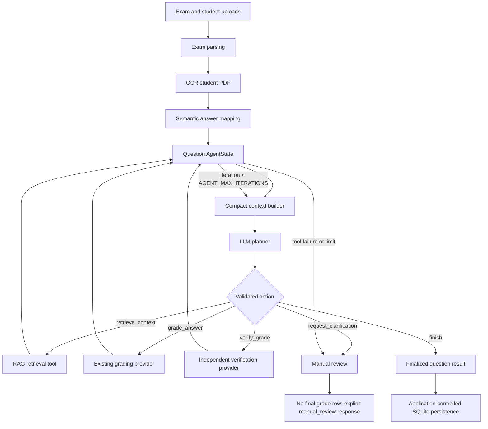

# Week 16 Architecture

The system uses one grading agent per question. The agent starts after OCR and semantic answer mapping and ends before deterministic SQLite persistence.

The model selects only schema-validated actions. Python owns tool execution, iteration limits, validation, and persistence. Full trajectories remain in `AgentState`; the planner receives bounded evidence and concise action summaries.

The architecture is single-agent rather than multi-agent because each question has one tightly scoped decision process. Separate agents would add coordination and token overhead without a separate ownership boundary in this application.

